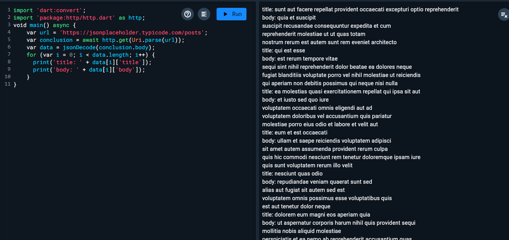

# mobile_app3
 <strong>Задание № 1: Простой Future</strong> 
 <strong>Задание № 2: Использование async/await</strong> 
 <strong>Задание № 3: обработка ошибок в Future</strong> 
 <strong>Задание № 4: Использование async/await с обработкой ошибок </strong> 
 <strong>Задание № 5: Простой Stream</strong> 
 <strong>Задание № 6:Использование async/await и Stream </strong> 
 <strong>Задание № 7: Обработка обибок Stream</strong> 
 <strong>Задание № 8: Использование async/await с обработкой ошибок Stream </strong> 
 <strong>Задание № 9: Создание Future из Stream</strong> 
 <strong>Задание № 10: Использование async/await с Future из Stream </strong> 
 <strong>Задание № 11: Cjplfybt Stream из Future  </strong> 
 <strong>Задание № 12: Использование async/await с Stream из Future</strong> 
 <strong>Задание № 13: Объединение двух Future</strong> 
 <strong>Задание № 14: Использование async/await c объединеним Future</strong> 
 <strong>Задание № 15: Объединение двух stream</strong> 
 <strong>Задание № 16: :Использование async/await c объединением Stream</strong> 
 <strong>Задание № 17:</strong> Преобразование Stream с использованием map 
 <strong>Задание № 18: Использованиеasync/await c преобразованием Stream</strong> 
 <strong>Задание № 19: Фильтрация Stram с использованием where</strong> 
 <strong>Задание № 20: :Использование async/await c фильтрацией Stream</strong> 
 <strong>Задание № 1: Асинхронная загрузка даннаых с API</strong> <b></b> 
 <strong>Задание № 2: Асинхронное выполнение нескольких задач</strong> <b></b>
 <strong>Задание № 3: Асинхронная обработка потока данных</strong>  
